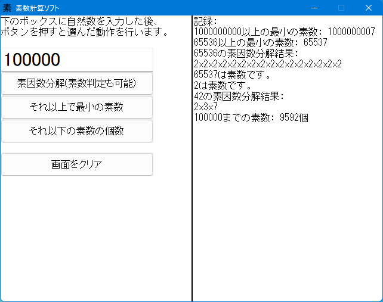

# 素数計算ソフト

素数繋がりの計算を行います。対応する数が 32-bit まで、処理中断ができない、Arm 版や SHARP Brain 版がないなどの制約があるので普通は [C++ 版](https://github.com/watamario15/prime-calculator)を使った方が良いですが、HSP3 言語を学校などで習った（そんな人いるのか？）プログラミング初学者の方にはこちらのコードの方が読みやすいかもしれません。元は高校時代に部活の見学で課題として作ったものです｡

## 実行

実行ファイルは [Releases](../../releases) から取得でき、Windows XP 以降の日本語環境で動作します。Linux/macOS でも Wine を使えば多分動きます。

ソースコードは `prime.hsp` で、[Hot Soup Processor 3](https://hsp.tv) のスクリプトエディタで開けます。一般のテキストエディタを使う場合は Shift_JIS (CP932) で開いてください。

## 著作権

著作権を放棄し、Public Domain ([CC0-1.0](LICENSE)) で配布します。
